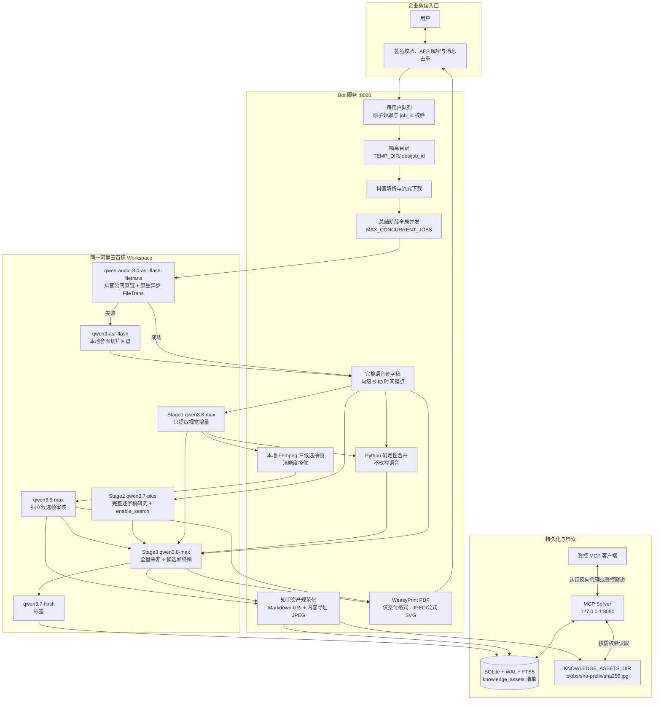

# 抖音全栈视频知识总结 Bot：项目详情

本文档说明 `douyin-bot` 的当前系统边界、全阿里云百炼 AI 管线、任务生命周期、稳定性设计、知识库和 MCP 接口，供开发、部署与运维使用。

---

## 1. 项目定位

本项目是一个基于 FastAPI 的企业微信 Bot。用户发送抖音视频链接后，系统完成以下工作：

1. 校验并解密企业微信回调消息。
2. 解析抖音页面，保留公网媒体直链并把视频下载到任务隔离目录。
3. 优先使用阿里云百炼原生异步 FileTrans 转写公网直链并保留句级时间戳，失败时才通过 FFmpeg 和兼容 ASR 做本地切片回退。
4. ASR 完成后并行运行 Stage1 视觉增量提取和 Stage2 完整逐字稿研究，再由 Python 确定性合并语音与视觉注释。
5. 将通过本地三候选择优和独立审核的候选帧作为编辑证据，与全量语音、视觉注释和内部研究备忘一起交给 Stage3；Stage3 再决定信息应转成 Markdown 还是保留截图。
6. 将终稿规范化为带时间和 caption 的标准 Markdown 图片引用，并把图片清单与元数据写入 SQLite。
7. 将审核 JPEG 按 SHA-256 内容寻址持久化到 `KNOWLEDGE_ASSETS_DIR`，使图片知识不依赖临时 PDF。
8. 把 PDF 作为企业微信交付格式渲染并发送；PDF 交付失败时降级为纯文字 Markdown。
9. 通过 MCP Server 向受控客户端提供知识库搜索、读取、统计以及按需多模态图片读取能力。

当前解析器只支持抖音域名下的分享链接和视频页链接，不提供 TikTok 解析。

---

## 2. 系统架构



系统由两个可独立运行的服务组成：

- Bot 服务处理企业微信消息、任务队列、视频、AI、数据库和文件交付。
- MCP 服务只读访问同一知识库，对外暴露检索工具；默认仅监听 loopback。

---

## 3. 模块划分

| 文件 | 主要职责 |
| :--- | :--- |
| `main.py` | FastAPI 生命周期、企业微信回调、每用户队列、任务状态机、全局并发、超时和健康检查。 |
| `app/config.py` | 环境变量加载、数值约束、模型映射与本地 AI 配置检查。 |
| `app/services/douyin_parser.py` | 链接提取、页面解析、视频流式下载、任务目录隔离、FFmpeg 音频提取和过期目录清理。 |
| `app/services/aliyun_client.py` | 统一百炼客户端、原生异步 FileTrans、兼容接口连接池、AI 并发、超时、退避重试和响应解析。 |
| `app/services/ai_summarizer.py` | 带时间戳文件转写、本地切片回退、并行视觉/研究、确定性增强逐字稿、截图审核、终稿与标签生成。 |
| `app/services/pdf_generator.py` | Markdown、HTML、CSS、审核 JPEG 与 Matplotlib 路径化公式 SVG 的 PDF 交付渲染。 |
| `app/services/video_frames.py` | 视觉截图候选校验、本地 FFmpeg 三帧提取、清晰度择优、安全 JPEG 处理、PDF 内嵌和内容寻址知识资产持久化。 |
| `app/services/wechat_api.py` | 企业微信 Access Token、文本、Markdown 与文件消息发送。 |
| `app/utils/wechat_crypto.py` | 企业微信回调签名与 AES 加解密。 |
| `app/database/knowledge_store.py` | SQLite 表、FTS5 索引、`knowledge_assets` 图片清单、内容哈希校验、读写、查重和旧版搜索。 |
| `app/services/note_chunker.py` | 按标题把笔记 Markdown 切成章节块，生成展示文本与向量化文本。 |
| `app/database/note_index.py` | `note_chunks` / `chunk_embeddings` 派生表、向量补算、语义 + 关键词混合检索与段落汇集。 |
| `scripts/build_note_index.py` | 建立或刷新章节索引的幂等脚本。 |
| `mcp_server.py` | Streamable HTTP / stdio MCP 服务与 10 个文字/图片知识库工具。 |

视频页面由 `httpx` 直接请求并读取 `_ROUTER_DATA`，项目当前不依赖 `yt-dlp` 完成解析。

---

## 4. 全阿里云百炼 AI 管线

整个管线共享一个 Workspace 的 `DASHSCOPE_API_KEY`。模型名称可通过环境变量覆盖，默认映射如下：

| 顺序 | 配置变量 | 默认模型 | 工作内容 |
| :---: | :--- | :--- | :--- |
| 1A | `ALIYUN_ASR_MODEL` | `qwen-audio-3.0-asr-flash-filetrans` | 将抖音公网直链提交到原生异步 FileTrans 服务，轮询结果并保留句级时间戳。 |
| 1B | `ALIYUN_ASR_FALLBACK_MODEL` | `qwen3-asr-flash` | 仅在主路径失败时，对本地音频切片逐段转写。 |
| 2A | `ALIYUN_VISUAL_MODEL` | `qwen3.8-max` | Stage1 对照完整带时间逐字稿提取视觉增量；不生成摘要或初稿。 |
| 2B | `ALIYUN_RESEARCH_MODEL` | `qwen3.7-plus` | Stage2 与 Stage1 并行，直接依据完整语音逐字稿进行联网核查和必要知识桥接。 |
| 2C | 本地 Python | 无 | 按片段 ID 和时间位置确定性地把视觉注释插入逐字稿，不调用模型改写语音。 |
| 2D | `ALIYUN_VISUAL_MODEL` | `qwen3.8-max` | 独立审核本地候选帧与注释的对应性、可读性、编辑价值和隐私安全。 |
| 3 | `ALIYUN_FINAL_MODEL` | `qwen3.8-max` | Stage3 融合全量原始/增强逐字稿、视觉证据、审核候选帧、研究备忘和用户要求，生成最终知识笔记。 |
| 4 | `ALIYUN_TAG_MODEL` | `qwen3.7-flash` | 生成 5-10 个中文语义标签。 |

`ALIYUN_DRAFT_MODEL` 仅保留为升级现有部署时的配置兼容回退；新部署和文档统一使用 `ALIYUN_VISUAL_MODEL`。

### 4.1 原生异步文件转写与本地回退

主路径使用 `qwen-audio-3.0-asr-flash-filetrans`。解析器取得抖音媒体直链后，系统通过 `DASHSCOPE_NATIVE_BASE_URL` 向原生 DashScope FileTrans 接口提交异步任务，并按 `ASR_FILE_POLL_INTERVAL_SECONDS` 轮询状态，最多等待 `ASR_FILE_TIMEOUT_SECONDS`。默认值分别为 2 秒和 1800 秒。解析结果不仅保留完整文本，也保留 FileTrans 返回的句级起止时间，并规范化为 `S0001`、`S0002` 等稳定片段 ID，供视觉增量做时间与语义锚定。

FileTrans 的 `file_urls` 有明确的网络语义：它必须包含阿里云百炼服务端能从公网访问的 HTTP(S) URL，而不是当前 Bot 服务器上的文件位置。以下两类值不能使用：

```text
/tmp/douyin-bot/jobs/<job_id>/video.mp4
file:///tmp/douyin-bot/jobs/<job_id>/video.mp4
```

项目优先提交解析得到且仍有效的抖音视频公网直链。这样无需把本地文件二次上传到外部对象存储，也避免把大音频编码进同步请求。

以下任一情况发生时，系统自动进入回退路径：公网直链不可用、FileTrans 提交失败、异步任务失败或超时、轮询或结果解析失败。回退流程为：

1. 从任务隔离目录中的本地视频提取 16 kHz 单声道 MP3。
2. 使用 FFprobe 检查时长和大小。
3. 超过 `ASR_SEGMENT_SECONDS` 或 `ASR_MAX_FILE_MB` 时，按默认 240 秒、7 MB 阈值切片。
4. 通过 OpenAI 兼容地址调用 `qwen3-asr-flash` 逐段转写并合并文本。
5. 回退接口没有可靠句级时间戳时，按句子长度在已知音频区间内生成近似时间；该质量会标为 `segment_approx`，不会伪装成 FileTrans 的 `sentence_exact`。

临时回退切片无论成功或失败都会在 `finally` 中清理。FileTrans 是性能和大文件适配更好的主路径，本地切片则确保直链或原生异步服务异常时任务仍能继续。

### 4.2 ASR 后并行分支与确定性合并

ASR 完成后，系统立即用 `asyncio.gather` 并行启动两个互不依赖的分支：

- Stage1 把视频和带 `S-ID` 的完整逐字稿交给 `qwen3.8-max`，只提取语音未表达但画面确实承载的新增信息。
- Stage2 把完整语音逐字稿直接交给 `qwen3.7-plus` 开展联网研究；它不等待 Stage1，也不读取或猜测视觉结果。

Stage1 不是摘要器，也不生成中间初稿。它不得改写、压缩、润色、事实核查或扩展逐字稿，只能输出经过结构校验的视觉注释，包括时间区间、语音锚点、证据类型、置信度和客观描述。它分别给出“是否抽取原帧供终稿编辑器核对”和“是否可能值得向读者展示”的建议：可完整转写的 OCR、列表、简单表格或代码可以需要前者而不需要后者；难以文字化的形态、空间关系、对象外观或关键动作姿态才倾向后者。普通字幕水印、人物出镜、装饰画面、语音同义复述和模糊细节均应忽略；开头、转场或结尾短暂出现的主题身份标识则不能仅因时长短或带框选而忽略。没有有效视觉增量时返回空数组。

短视频（不超过 180 秒）以 `fps=2` 分析，并使用更高的单帧像素上限，降低短暂小字和标识漏检概率；更长视频保持较低采样率和像素预算。抽帧数量仍有硬上限，避免把“给编辑器看”变成无界图片堆积。

两个分支结束后，本地 Python 按 `anchor_segment_id` 和时间顺序将视觉注释插入原语音片段，生成增强逐字稿。该过程是确定性的：每条原语音恰好保留一次，模型不能借“整理”删除后半段、案例或细节。Stage1 失败时则使用未增加视觉注释的完整逐字稿继续。

### 4.3 本地候选帧提取与独立审核

只有 Stage1 明确建议抽取编辑候选帧、置信度和类型符合要求、且未标记敏感信息的视觉注释才有资格进入抽帧链路。这个建议与最终是否向读者展示图片分离；模型只提议内容和时间，不能决定本地路径或直接把图片放入文档。

`video_frames.py` 对每个候选执行以下步骤：

1. 校验视频绝对路径、任务目录边界、文件类型、大小、时长、注释 ID、时间区间和最大截图数。
2. FFmpeg 在目标区间中心及其前后附近各抽取一帧，共三个候选；时间越界时进行安全收敛和去重。
3. 使用本地 Pillow 指标综合比较边缘细节、曝光、过曝/欠曝比例和对比度，选出最清晰候选。
4. 对高宽比不小于 `1.35` 的竖屏社交视频，使用确定性的边缘细节与非黑区域密度扫描，裁出信息最集中的方形证据区；独立多模态审核看到的是最终裁切结果，关键内容若被裁坏会被拒绝。
5. 30 秒内、注释语义相同且平均视觉哈希高度近似的候选只保留质量更高的一张；时间接近本身不再构成删除理由，避免同一页面里先后出现的不同关键区域在交给 Stage3 前被误合并。
6. 移除元数据、限制尺寸和文件大小，重新编码为固定文件名、权限为 `0600` 的 JPEG。
7. 把候选 JPEG、原视觉注释和附近逐字稿交给一次独立的 `qwen3.8-max` 多模态审核，先逐图检查对应性、可读性、单帧证据能力、编辑价值和敏感信息，再从整组候选中只保留最小非重复视觉证据集合。文字或表格最终可能转写为 Markdown，不会仅因此在本阶段被拒绝。

候选帧审核采用 fail-closed：模型调用失败、输出无效、图片不清、描述不对应、只是装饰、含敏感信息或任何本地处理失败时，该帧不会交给 Stage3，但文字管线继续。审核可收紧帧说明，最终视觉文字与图片 caption 使用同一审核结果，避免互相矛盾。

审核通过的候选 JPEG 会以受限 Base64 图像输入随 ID、时间和 caption 交给 Stage3。Stage3 先用它们核对和理解视觉信息：纯文字、数字、代码、列表和可准确还原的简单表格优先转成 Markdown；只有文字化会明显损失形态、位置、空间关系、视觉编码、对象外观、演示结果或关键静态姿态时才插入受控临时标记。候选帧输入失败时 Stage3 以完整文字证据重试。Stage3 不能自行构造路径或图片 URL。终稿完成后，实际引用的受审图片产生两条彼此独立的输出路径：

- 知识持久化路径把实际引用的 JPEG 计算 SHA-256，保存为 `KNOWLEDGE_ASSETS_DIR/blobs/<哈希前两位>/<完整哈希>.jpg`，并把临时标记替换成带时间和客观 caption 的标准 Markdown 图片语法，例如 ``。相同内容可复用同一 blob，正文不暴露服务器路径。
- PDF 交付路径把临时标记替换为经再次校验、Base64 内嵌的 JPEG；同一图片最多插入一次并受总大小上限约束。证据图在打印样式中设置 `155mm` 最大高度，图片与 caption 作为不可拆分页单元，避免竖图整页放大后把说明挤到单独空白页。PDF 只是一次性交付格式，不是图片知识的持久化边界。

SQLite 的 `knowledge_assets` 表保存笔记 ID、逻辑图片 ID、时间、caption、类型、置信度、尺寸、字节数、SHA-256、内容寻址相对路径、质量分和展示顺序。保存或覆盖笔记时，Markdown 与图片清单在同一事务中更新；无引用 blob 经过 24 小时宽限期后，仅在下次 Bot 启动、尚未接收任务时清理，避免并发任务刚复用同一内容哈希但尚未提交清单时发生误删。持久化失败或图片无效时只移除对应引用并继续保存文字，已有的有效知识资产不会变成裸本地路径。

### 4.4 Chat Completions 联网研究

`qwen3.7-plus` 通过 OpenAI 兼容 Chat Completions 调用：

```json
{
  "model": "qwen3.7-plus",
  "enable_search": true,
  "enable_thinking": false
}
```

该阶段只产生供终稿编辑使用的内部备忘，不复述视频，不展示搜索词、推理、失败尝试或逐步核查过程。它不是纯质疑模块，职责按优先级为：纠正会改变结论或操作结果的重大事实错误；解释真正阻碍理解的最低限度概念；补齐决定说法适用范围的时间、版本、行业或制度边界；证据不足的重要问题保留归属表达。删除后不影响理解的旁支扩展会被主动舍弃。

Stage2 在全部时长档都关闭思考，并按时长限制输出 Token 与备忘正文字符数：

| 视频时长 | 研究模式 | 最大输出 Token | 备忘正文字符上限 | 思考 |
| :--- | :--- | ---: | ---: | :--- |
| ≤ 60 秒 | `bridge` | 1,600 | 900 | 关闭 |
| 61-180 秒 | `bridge_balanced` | 2,200 | 1,400 | 关闭 |
| 181-300 秒 | `balanced` | 2,800 | 1,800 | 关闭 |
| 301-450 秒 | `balanced` | 3,600 | 2,200 | 关闭 |
| 451-599 秒 | `balanced` | 4,400 | 2,600 | 关闭 |
| ≥ 600 秒 | `verify_focused` | 5,200 | 3,000 | 关闭 |

字符上限是上限而不是目标。短视频允许用较高的相对篇幅补最必要的概念桥；长视频通常已有较完整结构，研究更集中于高影响断言和隐含边界。信息密度提示只改变预算内的取舍，不改变档位。

联网研究是可降级阶段。如果调用最终失败，系统改用中性空备忘，终稿继续执行，但只能依赖完整语音和已有视觉证据，不得补造外部事实或展示失败过程。

### 4.5 终稿与标签

所有档位的 Stage3 都完整读取以下来源，不存在只有最高档才能看到原始逐字稿的特例：

- `primary_audio_transcript_verbatim`：未经摘要的完整语音原文，用于检查增强文本没有漏句。
- `primary_enhanced_transcript`：Python 确定性合并后的完整语音与时间对齐视觉增量，是正文组织的主要输入。
- `primary_visual_evidence`：每条视觉信息的类型、置信度、时间、编辑候选帧可用状态和初步展示建议。
- 审核候选帧：按视觉注释 ID 附带的真实 JPEG，仅供 Stage3 核对信息并决定 Markdown 与截图的最佳表达。
- `internal_research_memo_do_not_quote`：Stage2 的必要纠错、概念、背景、未决问题和来源。
- 视频元数据、用户关注点和当前时长策略。

生成档位只由视频时长决定，不再按转写字数、中间文本量或“高密度”标签升档。10 分钟达到最高思考档：

| 档位 | 视频时长 | 终稿思考 | 终稿硬 Token 上限 | 软篇幅参考 |
| :--- | :--- | :--- | ---: | :--- |
| `micro` | ≤ 60 秒 | 关闭 | 3,200 | 通常 400-1,000 个汉字 |
| `compact` | 61-180 秒 | `thinking_budget=1024` | 6,000 | 通常 900-2,200 个汉字 |
| `standard` | 181-300 秒 | `thinking_budget=2048` | 8,500 | 通常 1,400-3,200 个汉字 |
| `extended` | 301-450 秒 | `thinking_budget=4096` | 12,000 | 通常 2,200-4,800 个汉字 |
| `long` | 451-599 秒 | `thinking_budget=8192` | 18,000 | 通常 3,000-6,500 个汉字 |
| `ultra` | ≥ 600 秒 | `thinking_budget=16384` | 不发送 | 不设固定字数，完整覆盖有效信息 |

无法取得有效视频时长时使用 `standard` 安全默认档。表中的硬上限是 `max_completion_tokens`；最高档不发送该字段。软篇幅不是配额，信息密度高时允许超过，内容不足时不得用常识或重复结论凑字。

终稿不采用固定的“视频 90% / 外部资料 10%”比例，而使用来源职责和覆盖清单控制内容：

- 完整语音与画面共同决定主题、主体结构、观点、机制、步骤、案例、数据、限制、风险、例外与结论。
- 视觉增量应在对应语义位置融入正文，不另建喧宾夺主的“视觉补充”章节。
- 候选帧首先是编辑证据而不是展示配额；能准确文字化的内容优先使用 Markdown，只有关键视觉关系难以被文字替代时才保留截图。
- 研究备忘只用于解决理解障碍、补足适用边界和处理重大事实问题，不得扩展成平行主题，也不得伪装成视频原话。
- 用户要求只决定关注点与呈现方式，不能改变视频事实或要求补造缺失材料。
- 正文先判断材料属于解释、论证、叙事、流程、比较或混合型，再选择 Markdown 信息容器：连续论证使用少而完整的自然段；三个以上并列观点、条件、风险、经验或数据改用列表；具有重复比较维度时使用表格；禁止用连续粗体段落模拟“第一、第二”列表。若相邻短段只是解释或延续同一思路则合并。
- 若干语义明确的二级标题只划分真正不同的主题、机制或流程阶段；只有单节内部存在多个复杂分支时才少量使用三级标题。相邻标题之间必须有足够的连贯正文，避免把每个信息点拆成“标题—一句话—标题”，也不把长文压成缺少导航的一整块。
- 输出前在内部检查核心主张、因果机制、操作流程、案例/演示、数字条件、限制/风险/反例和视觉独有信息是否都有落点；这份检查过程不写入文章。

一般措辞瑕疵不打断正文；只有会明显误导读者的问题才在准确呈现视频原意后，以简短“补充说明”处理。只有实际采用外部资料时才列参考资料。终稿不展示搜索、核查、纠正或编辑过程。

`qwen3.7-flash` 随后生成最多 10 个去重标签。若模型失败或返回空内容，系统从最终 Markdown 本地提取关键词，保证标签故障不阻塞笔记入库。

### 4.6 PDF 交付与矢量公式

PDF 是知识笔记的一种交付视图，规范 Markdown、`knowledge_assets` 清单和内容寻址 JPEG 才是可继续检索与多模态读取的持久层。生成 PDF 时，审核截图会从当前任务产物安全内嵌，不允许渲染器访问任意外部 URL 或本地路径。

LaTeX 公式采用 Matplotlib 的 MathText 本地渲染：

- `$$...$$` 块级公式使用 17 pt，`$...$` 行内公式使用 13 pt，分别匹配独立展示和正文基线可读性。
- 默认输出透明背景的矢量 SVG，并设置 `svg.fonttype=path`，把字形转换为路径，避免目标 PDF 环境缺少同款数学字体造成乱码或替换。
- Matplotlib 的共享字体和公式缓存由进程内互斥锁保护；并发 PDF 任务串行进入公式测量与 SVG 序列化临界区，避免缓存争用和不稳定输出。
- SVG 以受大小限制的 `data:image/svg+xml;base64,...` 内嵌；单个公式渲染失败时保留代码样式兜底，不让整份 PDF 失败。

### 4.7 Workspace 接入地址

配置中保留同一 Workspace 的两个根地址：

```dotenv
DASHSCOPE_API_KEY=replace_with_your_key
DASHSCOPE_BASE_URL=https://YOUR_WORKSPACE_ID.cn-beijing.maas.aliyuncs.com/compatible-mode/v1
DASHSCOPE_NATIVE_BASE_URL=https://YOUR_WORKSPACE_ID.cn-beijing.maas.aliyuncs.com/api/v1

ALIYUN_VISUAL_MODEL=qwen3.8-max
ALIYUN_RESEARCH_MODEL=qwen3.7-plus
ALIYUN_FINAL_MODEL=qwen3.8-max
```

- `DASHSCOPE_BASE_URL`：Workspace 专用 OpenAI 兼容根地址，用于视觉增量、截图独立审核、Chat Completions 联网搜索、终稿生成和 `qwen3-asr-flash` 本地切片回退。
- `DASHSCOPE_NATIVE_BASE_URL`：相同 Workspace 的原生 DashScope 根地址，用于 `qwen-audio-3.0-asr-flash-filetrans` 异步任务提交与轮询。
- Key、compatible 地址和 native 地址必须来自同一地域、同一 Workspace。
- 文档和配置模板只能保留占位符，真实 Key 不应提交到 Git 或打印到日志。

### 4.8 模型调用观测与价格快照

观测功能默认关闭；设置 `MODEL_USAGE_LOG_ENABLED=true` 并重启 Bot 后启用。`AliyunModelClient` 在逻辑调用边界统一采集使用量，不由各提示词阶段自行拼日志。Chat Completions、Responses、FileTrans 和本地 ASR 即使失败或取消也各写一条 `model_usage_log`；HTTP 重试累计到该条记录的 `request_count` 与 `retry_count`，不会被当成多次业务调用。FileTrans 的提交、轮询和结果下载仍属于同一个逻辑调用。

每条记录包含：`job_id`、`video_code`、模型名、`operation`、API 类型、状态、UTC 起止时间、耗时、请求/重试数、供应商 request/task ID、HTTP/错误类型、输入/输出/缓存/推理 Token、音频秒数、只含 usage 的原始 JSON、价格版本、币种、费率、估算费用和费用状态。`ContextVar` 会把任务关联信息安全传播到并行创建的 Stage1/Stage2 子任务。日志明确不写入企业微信用户 ID、提示词、逐字稿、研究备忘、终稿、媒体 URL、图片、API Key 或 Authorization 头。

价格版本 `aliyun-cn-beijing-2026-08-15` 固化从[阿里云百炼中国内地计费页面](https://help.aliyun.com/zh/model-studio/model-pricing)与控制台核对的人民币口径。滚动别名与日期快照可能价格不同；这里把 `qwen3.7-plus` 当日限时折扣和日期快照标准价分别登记：

| 模型 | 输入长度 | 输入 / 百万 Token | 缓存输入 / 百万 Token | 输出 / 百万 Token |
| :--- | :--- | ---: | ---: | ---: |
| `qwen3.7-flash` | ≤32K | ¥0.2 | ¥0.04 | ¥0.8 |
| `qwen3.7-flash` | 32K-256K | ¥0.6 | ¥0.12 | ¥2.4 |
| `qwen3.7-flash` | 256K-1M | ¥1.2 | ¥0.24 | ¥4.8 |
| `qwen3.7-plus` 滚动别名（当日限时价） | ≤256K | ¥1.6 | ¥0.32 | ¥6.4 |
| `qwen3.7-plus` 滚动别名（当日限时价） | 256K-1M | ¥4.8 | ¥0.96 | ¥19.2 |
| `qwen3.7-plus-2026-05-26` | ≤256K | ¥2 | ¥0.4 | ¥8 |
| `qwen3.7-plus-2026-05-26` | 256K-1M | ¥6 | ¥1.2 | ¥24 |
| `qwen3.8-max` | ≤1M | ¥12 | ¥1.5 | ¥36 |

`qwen-audio-3.0-asr-flash-filetrans` 与回退 `qwen3-asr-flash` 均按 CNY ¥0.00022/音频秒估算。估算不含内置联网搜索等附加费用，不抵扣免费额度，也不替代百炼账单。服务端缺少 usage、超出已登记价格档位、失败调用收费不明或模型未登记时，`estimated_cost` 为 `NULL` 并由 `cost_status` 说明原因，报表把它计入“费用未知”而不是 0。

启用后，日志库默认与知识库共用 `knowledge.db`，也可用 `MODEL_USAGE_DB_PATH` 分离；`/ready` 仅在启用时检查日志表。每条历史记录固化自己的价格版本、币种和费率，更新代码不会追溯改写旧记录；报表会按币种汇总并显示区间内出现的价格版本。采集关闭时仍可读取已有数据库：

```bash
venv/bin/python scripts/model_usage_report.py --days 7
venv/bin/python scripts/model_usage_report.py --days 7 --details --limit 200
```

---

## 5. 稳定性与故障隔离

### 5.1 任务身份与每用户队列

每个 `PendingTask` 创建不可复用的随机 `job_id`。任务的延时器、领取、查重确认、执行和队列推进都校验该 ID，过期回调无法推进或清理另一个任务。

每位用户拥有一个活跃任务和最多 3 个等待任务。任务开始前通过原子领取标志设置 `processing`，避免“立即开始”和 120 秒定时器同时触发同一任务。后台任务被集中跟踪，其异常会进入日志，不会静默丢失。

### 5.2 全局容量控制

系统有两层并发限制：

- `MAX_CONCURRENT_JOBS`：限制同时执行的音频提取、AI、入库和交付阶段，默认 2。
- `AI_MAX_CONCURRENCY`：限制所有百炼 HTTP 请求的并发，默认 3。

前者保护 FFmpeg、内存和 PDF 渲染，后者保护模型配额、连接池和限流预算。进入总结阶段后的每个任务还受 `JOB_TIMEOUT_SECONDS` 总超时控制。

### 5.3 临时文件隔离

每个任务只写入：

```text
$TEMP_DIR/jobs/<job_id>/
├── video.mp4.part
├── video.mp4
├── video.mp3                 # 仅回退路径需要
├── asr_0000.mp3              # 仅回退路径需要
├── video_frames/             # 可选候选与审核后 JPEG，任务结束即清理
│   └── video_frame_V0001.jpg
└── summary.pdf
```

目录函数只接受受约束的 `job_id`，任务结束时只删除该目录。服务启动时会清理超过 `TEMP_FILE_TTL_HOURS` 的遗留任务目录，避免进程崩溃后磁盘持续增长。`KNOWLEDGE_ASSETS_DIR` 是独立的持久化目录，不位于任务树中，也不会随任务清理；启动期垃圾回收只删除数据库清单未引用且已超过 24 小时宽限期的内容文件。

### 5.4 下载与媒体处理

- 视频流式写入 `.part` 文件，成功后通过原子替换发布为 `video.mp4`。
- 网络协议错误、连接错误、超时和 HTTP 状态错误默认最多尝试 3 次，并进行指数等待。
- 下载内容类型和最小文件大小会被校验，视频文件有 500 MB 安全上限。
- 主路径把抖音公网直链交给原生 FileTrans；只有主路径失败才进行本地音频提取和分段。
- 回退路径的音频提取和分段均有独立 FFmpeg 超时，阻塞命令在线程中执行，不阻塞 FastAPI 事件循环。
- 可选截图始终从任务目录的本地视频提取；三候选择优、JPEG 重新编码和独立审核任何一步失败都返回空截图，不中断文字终稿。
- 审核 JPEG 持久化前重新校验格式、大小和 SHA-256；读取时再次核对清单中的字节数、JPEG 头尾和内容摘要。

### 5.5 百炼客户端重试

统一客户端复用一个 `httpx.AsyncClient` 和受限连接池。默认单次请求超时为 240 秒，对网络异常和以下 HTTP 状态进行重试：

```text
408, 409, 425, 429, 500, 502, 503, 504
```

客户端优先遵循 `Retry-After`，否则使用带随机抖动的指数退避，单次等待最长 30 秒。不可重试的 4xx 会立即失败，错误正文会截断并清洗后写入日志，避免异常响应污染输出。

### 5.6 生命周期与交付降级

关闭服务时，系统停止接收新消息，取消等待定时器，给后台任务最多 20 秒收尾，然后取消剩余任务并关闭百炼与企业微信 HTTP 客户端。

规范 Markdown、图片清单和知识 JPEG 在 PDF 渲染前完成持久化，PDF 只承担交付。PDF 生成、上传或发送任一步失败时，已入库的多模态知识不受影响，任务会向企业微信发送移除临时截图标记后的纯文字 Markdown 作为兜底。正常 AI 管线不发送 FileTrans、视觉增量、联网研究和终稿生成等常规阶段通知；FileTrans 失败、无公网直链、切换本地 ASR、提取或分段回退等异常路径仍保留必要提示。截图缺失属于正常可降级结果，不单独打扰用户。这些企业微信通知采用 best-effort 方式，单次发送失败不会阻止文件清理或队列推进。

---

## 6. 健康检查

Bot 服务提供三个端点：

| 端点 | 含义 | 成功条件 |
| :--- | :--- | :--- |
| `/live` | 存活检查 | FastAPI 进程能响应。 |
| `/ready` | 就绪检查 | AI 配置、FFmpeg/FFprobe、数据库、临时目录和接收状态均正常。 |
| `/health` | 兼容入口 | 与 `/ready` 使用同一逻辑。 |

`/ready` 还要求临时目录可写且剩余空间不少于 512 MB。它只做本地检查，不会发起付费模型请求。异常时返回 HTTP 503，并在 `problems` 字段列出原因。

推荐部署探测：

```bash
curl -fsS http://127.0.0.1:8080/live
curl -fsS http://127.0.0.1:8080/ready
```

---

## 7. 数据库与检索

`KnowledgeEntry` 保存以下核心字段：

| 字段 | 内容 |
| :--- | :--- |
| `video_id` | 抖音原始视频 ID |
| `title`、`author` | 标题与作者，用于查重和展示 |
| `source_url` | 原始分享链接 |
| `summary_markdown` | 最终标准 Markdown；被引用截图以 `knowledge-asset://<video_code>/<asset_id>` 表示，alt 文本包含时间和 caption |
| `tags` | `qwen3.7-flash` 或本地降级逻辑生成的标签 |
| `user_requirement` | 用户的特别要求 |
| `video_code` | 唯一 5 位视频码 |
| `created_at`、`timestamp` | 创建时间 |

`summary_markdown` 不保存 Base64、大文件或服务器路径。一个规范图片引用形如：

```markdown

```

SQLite 的 `knowledge_assets` 表是图片资产清单，以 `knowledge_id + asset_key` 唯一定位笔记内图片，保存 `mime_type`、`relative_path`、`sha256`、字节数、宽高、视频时间点、caption、视觉类型、置信度、质量分和展示顺序。JPEG 本体位于 `KNOWLEDGE_ASSETS_DIR/blobs/<sha256 前两位>/<sha256>.jpg`；相同内容自然复用同一路径，而逻辑 URI 在文件去重或部署迁移后保持稳定。图片列表接口从不返回服务器路径。

SQLite 使用 WAL 提高读写并存能力。旧的 FTS5 表仍由触发器同步，但只作为章节索引尚未建立时的兜底。

### 7.1 章节级混合检索

检索单位是笔记的章节而不是整篇笔记。`app/services/note_chunker.py` 按 H1/H2/H3 标题把 Markdown 切成章节块（围栏代码内的 `#` 不算标题，超过 1,200 字的章节按段落再切，零散碎片并入前一块），每块保留原始 Markdown 供展示，另生成去掉格式和图片 URI 的 `embed_text` 用于哈希与向量化。当前库 253 条笔记约 3,000 块，中位数 214 字。

`app/database/note_index.py` 在同一 SQLite 中维护两张派生表：

| 表 | 内容 |
| :--- | :--- |
| `note_chunks` | `knowledge_id`、`chunk_index`、`heading_path`、正文、`embed_text` 及其 SHA-256；随笔记删除级联删除 |
| `chunk_embeddings` | 以 `embed_text` 哈希 + 模型 + 维度为主键的 L2 归一化 float32 向量；文本不变则不重算 |

向量由同一 Workspace 的 `text-embedding-v4`（1024 维，OpenAI 兼容 `embeddings` 接口，单次最多 10 条）生成，调用与其他模型一样进入 `model_usage_log`。检索时全部向量载入内存做余弦，几千块规模下毫秒级完成；缓存以表行数为代际号，写入后自动失效。

查询走两路召回再用 RRF（k=60）融合：

1. 语义通道：查询向量与全部章节向量的余弦，取前 200；
2. 关键词通道：查询按空格/逗号拆词，在章节正文、标题路径、笔记标题和标签中做大小写不敏感的原文匹配（正文 1 分、标题和标签各 0.5 分），保证产品名、工具名这类向量模糊的词精确命中。

笔记排序由其最佳章节决定，命中章节数只做并列时的次序；RRF 分数在名次之间几乎平坦，任何求和式聚合都会让"多段弱命中"压过"单段强命中"。`search_precise` 要求所有关键词都出现在同一条笔记中（标题、标签或任一章节），再按同样的规则排序。语义通道不可用（未配置 Key、接口失败）时自动退化为纯关键词检索并在结果中标明。

`collect_sections` 按融合顺序挑选章节正文直到字数预算：每条笔记最多贡献若干段，与已选段落余弦 ≥ 0.92 的近重复段落被跳过，输出按笔记分组并标注视频码与章节路径。这是"把所有讲 X 的段落一次读完"的入口：20 条相关笔记的全文约 6.8 万字，而它们的相关章节通常 1 万字左右。

索引是派生数据。首次部署或升级后运行 `venv/bin/python scripts/build_note_index.py` 建立（`--rebuild` 重切所有笔记、`--no-embed` 只切分、`--stats` 查看状态）；此后 Bot 在每条笔记入库后于后台切分并向量化，启动时补齐遗漏。标准 Markdown 的时间与 caption 保留在正文 alt 文本中，因此纯文本搜索和不支持图片的客户端仍能理解该视觉证据的基本含义；需要查看原图时再通过 MCP 按需读取。

---

## 8. MCP Server

MCP 服务提供 10 个工具：

| 工具 | 参数 | 作用 |
| :--- | :--- | :--- |
| `search_notes` | `query`, `limit`（默认 10，最多 30） | 章节级混合检索；每条笔记只出现一次，返回视频码、入库日期、命中章节数、相似度、最佳章节标题与片段。 |
| `search_notes_precise` | `query`, `limit` | 所有关键词都必须命中同一条笔记的精确搜索，命中后按相关性排序。 |
| `collect_sections` | `query`, `max_chars`（默认 12,000）, `max_per_note`（默认 3） | 汇集最相关的章节正文，跨笔记去重，按笔记分组返回。 |
| `get_note` | `note_id` | 按数据库 ID 获取完整 Markdown 与元数据；存在图片时提示可按需读取。 |
| `get_note_by_code` | `video_code` | 按 5 位视频码获取完整 Markdown；保留正文中的逻辑图片 URI。 |
| `list_note_images` | `note_id` | 按展示顺序列出图片 ID、时间、caption 和 `knowledge-asset://` 引用，不暴露文件路径。 |
| `get_note_image` | `video_code`, `asset_id` | 解析逻辑引用，校验清单、大小、JPEG 格式和 SHA-256 后返回 MCP `Image`。 |
| `list_notes` | `limit`, `offset` | 分页列出最近笔记。 |
| `list_by_tag` | `tag`, `limit` | 按标签筛选笔记。 |
| `knowledge_stats` | 无 | 查看总笔记数、最新记录、数据库路径与章节索引状态。 |

默认配置为：

```dotenv
MCP_HOST=127.0.0.1
MCP_PORT=8090
```

推荐的消费顺序是 `search_notes` 找候选、`collect_sections` 一次读完相关段落、`get_note_by_code` 读整篇；意图路由由 MCP 客户端选择工具完成，服务端不做查询分类。默认 loopback 监听并保留 FastMCP 的 DNS rebinding 防护。多模态客户端先读取笔记文字，只有需要核对某张视觉证据时才调用 `list_note_images` / `get_note_image`，避免在每次检索中传输全部 JPEG。远程客户端应通过带身份认证的 HTTPS 反向代理、VPN 或受控隧道访问，不应把 MCP 端口直接绑定到公网地址。

---

## 9. 配置基线

建议从 `.env.example` 复制配置，并限制权限：

```bash
cp .env.example .env
chmod 600 .env
```

关键容量参数：

| 变量 | 默认值 | 调整原则 |
| :--- | :---: | :--- |
| `AI_REQUEST_TIMEOUT_SECONDS` | 240 | 仅在长输出稳定触发超时时增加。 |
| `AI_MAX_RETRIES` | 3 | 限流频繁时优先降低并发，不宜无限增加重试。 |
| `AI_MAX_CONCURRENCY` | 3 | 不应高于 Workspace 配额可承受范围。 |
| `ASR_FILE_POLL_INTERVAL_SECONDS` | 2 | FileTrans 状态轮询间隔；不宜设置过低。 |
| `ASR_FILE_TIMEOUT_SECONDS` | 1800 | FileTrans 从提交到完成的总等待上限。 |
| `ASR_SEGMENT_SECONDS` | 240 | 仅控制回退路径；分段仍超过文件上限时降低。 |
| `ASR_MAX_FILE_MB` | 7 | 仅控制回退路径，应低于兼容 ASR 接口的单文件限制。 |
| `MAX_CONCURRENT_JOBS` | 2 | 根据 CPU、内存和 API 配额调整总结阶段容量。 |
| `JOB_TIMEOUT_SECONDS` | 3600 | 必须覆盖音频提取到文件交付的处理时间。 |
| `DOWNLOAD_TIMEOUT_SECONDS` | 600 | 限制单个视频解析与下载占用连接和磁盘的时间。 |
| `TEMP_FILE_TTL_HOURS` | 24 | 根据任务周期和磁盘容量调整。 |
| `MODEL_USAGE_LOG_ENABLED` | `false` | 设为 `true` 并重启 Bot 后采集新调用；关闭不影响读取已有报表。 |
| `MODEL_USAGE_DB_PATH` | 与 `KNOWLEDGE_DB_PATH` 相同 | 可指向独立 SQLite；必须位于持久化、可备份且 Bot 可写的位置。 |
| `KNOWLEDGE_ASSETS_DIR` | 与数据库同级的 `knowledge_assets/` | 必须是受 Bot 与 MCP 共同访问的绝对持久化目录；备份、迁移和容量规划应与 SQLite 同步。 |

---

## 10. 已知边界

- 用户队列保存在内存中，进程重启后尚未完成的任务不会恢复。
- SQLite 适合单机部署；多实例横向扩展需要外部队列和共享数据库。
- `/ready` 不验证百炼余额、模型权限或真实网络连通性，完整验证需要受控的端到端测试。
- FileTrans 主路径可回退到本地切片 ASR；两条 ASR 路径都失败时任务无法生成笔记。
- 联网研究、视觉增量和截图均可独立降级；可靠转写与终稿仍是生成笔记的必要阶段。
- 多模态知识由 SQLite 清单和 `KNOWLEDGE_ASSETS_DIR` 两部分组成；只备份数据库或只复制 blob 目录都不是完整备份。
- 抖音页面结构或反爬策略变化可能导致解析失败。
- MCP 本身不承担公网认证，安全边界必须由 loopback、反向代理或隧道建立。

---

## 11. 运维检查清单

部署或升级后建议依次确认：

1. `.env` 权限为 `600`，且未进入 Git。
2. Key、compatible URL、native URL 属于同一百炼 Workspace。
3. FileTrans 主模型、ASR 回退模型、`ALIYUN_VISUAL_MODEL` 及其余模型映射与 Workspace 已开通能力一致；旧 `ALIYUN_DRAFT_MODEL` 仅用于迁移兼容。
4. `ffmpeg`、`ffprobe`、Matplotlib 和中文字体可用；公式测试确认块级 17 pt、行内 13 pt 的路径化 SVG 能生成。
5. `/live` 返回 200，`/ready` 返回 200 且 `problems` 为空。
6. MCP 仍监听 `127.0.0.1`，公网入口具有认证与 TLS。
7. `KNOWLEDGE_ASSETS_DIR` 为绝对路径、权限受限且磁盘空间充足；备份任务同时覆盖 SQLite 与该目录。
8. 使用一个包含界面、图表和公式的短视频验证句级时间戳、并行视觉/研究、确定性合并、截图审核、二/三级标题结构、规范图片 URI、内容寻址入库、MCP 按需取图和 PDF 交付。
9. 如已启用用量观测，运行 `scripts/model_usage_report.py --days 1 --details`，确认七类调用可关联到同一 `job_id`/视频码，Token 或音频时长存在，费用未知项有明确原因。
10. 日志中没有 Key、Authorization 头、提示词、逐字稿、媒体 URL、资产绝对路径或完整异常响应。

以上设计将模型供应链统一到阿里云百炼，并把 Markdown、图片清单和内容寻址 JPEG 作为可持续读取的多模态知识层；PDF 仅负责交付。任务隔离、容量控制、超时重试、完整性校验、健康检查和最小暴露面共同降低单机运行风险。
