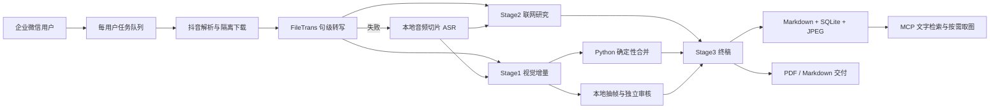

# 抖音多模态视频知识 Bot


这是一个面向企业微信的抖音视频知识整理服务。用户发送抖音链接后，Bot 会完成解析下载、语音转写、视觉增量提取、联网研究、终稿编辑、截图审核、知识入库和 PDF 交付。持久层以 Markdown、SQLite 图片清单和内容寻址 JPEG 为准，PDF 只是交付视图；内置 MCP Server 可让多模态客户端继续检索文字并按需读取视频截图。

当前版本已经统一使用同一阿里云百炼 Workspace 下的 Qwen 模型，不依赖第三方中转 API。

> 当前解析器只支持抖音分享链接及抖音视频页链接，不支持 TikTok。默认部署为单机、单进程队列架构。

## 处理流程



ASR 完成后，Stage1 和 Stage2 并行运行。Stage1 只提取逐字稿没有表达的画面信息，不生成摘要；Stage2 直接读取完整语音逐字稿，不依赖 Stage1。视觉注释由 Python 按语音片段 ID 和时间确定性插回逐字稿，Stage3 始终同时看到完整原始逐字稿、增强逐字稿、视觉证据和内部研究备忘。

## 当前功能

### 企业微信交互与队列

- 收到首个抖音链接后立即回复，用户可以发送“开始”、发送一条自定义要求，或等待 120 秒自动处理。
- 自定义要求会立即触发处理；“取消”可取消尚未开始或等待确认的任务。
- 每位用户拥有一个活跃任务和最多 3 个等待任务；处理中发送的新链接自动入队。
- 发送“队列”“状态”或 `queue` 可查询当前状态。
- 按标题和作者检测重复视频，并提供“覆盖”“新增”“取消”三种处理方式；重复确认 120 秒无响应时默认取消。
- `MAX_CONCURRENT_JOBS` 限制跨用户的下载与总结并发，`JOB_TIMEOUT_SECONDS` 防止异常任务永久占用队列。

### 全 Qwen 模型管线

| 环节 | 默认模型 | 实际职责 |
| :--- | :--- | :--- |
| 文件转写主路径 | `qwen-audio-3.0-asr-flash-filetrans` | 通过原生 DashScope 异步接口提交抖音公网媒体 URL，保留句级时间戳。 |
| 本地转写回退 | `qwen3-asr-flash` | FileTrans 不可用时提取本地音频，按 240 秒或 7 MB 阈值切片后逐段转写。 |
| Stage1 视觉增量 | `qwen3.8-max` | 对照完整带时间逐字稿，只提取语音未覆盖的画面信息。 |
| Stage2 联网研究 | `qwen3.7-plus` | 使用 `enable_search=true` 做必要事实核查、概念桥接和适用边界补充。 |
| 截图独立审核 | `qwen3.8-max` | 审核候选帧的对应性、清晰度、正文价值、重复性和敏感信息。 |
| Stage3 终稿 | `qwen3.8-max` | 把完整语音、视觉证据和研究备忘编辑为连贯的 Markdown 知识文章。 |
| 语义标签 | `qwen3.7-flash` | 生成最多 10 个中文检索标签；失败时回退到本地提取。 |

Stage2 在所有档位关闭思考。Stage3 的思考预算和输出护栏只由视频时长决定，不因转写字数升降档；达到 10 分钟后使用最高档。

| 视频时长 | Stage2 API 输出上限 / 提示正文上限 | Stage3 思考预算 | Stage3 硬输出上限 | 终稿软篇幅参考 |
| :--- | :--- | ---: | ---: | :--- |
| ≤ 60 秒 | 1,600 Token / 900 字符 | 关闭 | 3,200 Token | 通常 400-1,000 汉字 |
| 61-180 秒 | 2,200 / 1,400 | 1,024 | 6,000 | 通常 900-2,200 汉字 |
| 181-300 秒 | 2,800 / 1,800 | 2,048 | 8,500 | 通常 1,400-3,200 汉字 |
| 301-450 秒 | 3,600 / 2,200 | 4,096 | 12,000 | 通常 2,200-4,800 汉字 |
| 451-599 秒 | 4,400 / 2,600 | 8,192 | 18,000 | 通常 3,000-6,500 汉字 |
| ≥ 600 秒 | 5,200 / 3,000 | 16,384 | 不设置 | 完整覆盖有效信息 |

篇幅是软护栏，不是凑字目标。终稿以视频语音和画面为主体，研究内容只用于解决理解障碍、重大事实问题和适用边界；正常流程不会向企业微信发送四个 AI 阶段的进度消息，仅在 FileTrans 失败并切换本地识别等降级场景发送必要提示。

### 模型用量与费用观测

该功能默认关闭。需要开始观测时，在 `.env` 设置 `MODEL_USAGE_LOG_ENABLED=true` 并重启 Bot；之后每次逻辑模型调用会写入 SQLite 的 `model_usage_log`。记录包括任务 ID、视频码、模型、处理环节、成功/失败/取消、起止时间、耗时、请求与重试次数、服务端 request ID、输入/输出/缓存/推理 Token、音频时长和价格快照下的估算费用。视觉分析、截图审核、联网研究、终稿和标签会分别标识；一次 HTTP 重试不会被误记成多次业务调用。

观测日志不保存提示词、逐字稿、模型输出、用户 ID、API Key 或媒体 URL。当前规则 `aliyun-cn-beijing-2026-08-15` 按[阿里云百炼中国内地计费页面](https://help.aliyun.com/zh/model-studio/model-pricing)核对人民币阶梯价：`qwen3.7-flash` 为输入 ¥0.2/¥0.6/¥1.2、输出 ¥0.8/¥2.4/¥4.8（对应输入长度 ≤32K/≤256K/≤1M）；`qwen3.7-plus` 滚动别名按当日限时价输入 ¥1.6/¥4.8、输出 ¥6.4/¥19.2（≤256K/≤1M）；`qwen3.8-max` 输入 ¥12、输出 ¥36。缓存输入按对应模型与档位单独计价，两条 ASR 路径都按 ¥0.00022/音频秒估算。

估算费用不等于账单：它不含内置联网搜索等附加费用，也不抵扣免费额度，后续促销或调价不会追溯改写历史行；每条记录保留当时的 `pricing_version`、币种和费率。服务端缺少 usage、失败调用收费不明、超出已登记档位或模型未登记时，费用保留为“未知”，不会错误按 0 计算。即使采集开关关闭，也可以用报表读取数据库中已有记录。

```bash
# 最近 7 天汇总
venv/bin/python scripts/model_usage_report.py --days 7

# 同时查看最近 200 次调用明细，也可加 --job-id 精确筛选
venv/bin/python scripts/model_usage_report.py --days 7 --details --limit 200
```

### 截图、知识库与交付

- FFmpeg 在视觉注释目标时间附近抽取三个候选帧，本地按细节、曝光和对比度择优。
- 竖屏视频会裁到信息密度较高的证据区域；近时间或视觉哈希近似的画面会去重。
- 截图审核采用 fail-closed：模型或本地处理失败、图片模糊、内容不对应、仅作装饰或包含敏感信息时直接舍弃，但文字笔记继续生成。
- 只有审核通过且被终稿实际引用的 JPEG 才会按 SHA-256 持久化到 `KNOWLEDGE_ASSETS_DIR/blobs/`。
- 规范 Markdown 使用 `knowledge-asset://<video_code>/<asset_id>` 逻辑 URI，不保存服务器绝对路径。
- SQLite 使用 WAL 和 FTS5，提供标签优先、全文检索和 `LIKE` 兜底，以及多关键词 AND 精确搜索。
- PDF 支持 Markdown、表格、代码和 LaTeX。公式由 Matplotlib 渲染为路径化矢量 SVG；视频截图经再次校验后以内嵌数据交给 WeasyPrint。
- PDF 生成、上传或发送失败时，知识仍已入库，并自动降级为企业微信 Markdown 消息。

更完整的提示词职责、截图安全链路、动态预算、故障隔离和数据模型见 [PROJECT_DETAILS.md](PROJECT_DETAILS.md)。

## 快速部署

### 环境要求

- Alibaba Cloud Linux 3 或其他可运行 Python 3.11 的 Linux；提供的自动脚本使用 `yum`。
- root 权限，且项目位于 `/root/douyin-bot`。
- FFmpeg、FFprobe、Noto Sans CJK 等中文字体。
- 可接收企业微信回调的 HTTPS 域名或受控入口。
- 已开通所需模型和联网搜索能力的阿里云百炼 Workspace。

### 1. 克隆与安装

```bash
git clone https://github.com/skepty2333/Douyin-full-stack-summarizer.git /root/douyin-bot
cd /root/douyin-bot
chmod +x scripts/setup.sh
sudo ./scripts/setup.sh
```

安装脚本会安装系统依赖、建立 `venv`、安装锁定版本的 Python 依赖、校验导入并安装/启用 `douyin-bot.service` 与 `douyin-mcp.service`。脚本不会替你签发域名证书，也不会自动启动尚未配置的服务。

### 2. 配置环境变量

```bash
cd /root/douyin-bot
cp .env.example .env
vi .env
chmod 600 .env
```

最关键的百炼配置如下。Key、兼容地址和原生地址必须属于同一地域、同一 Workspace：

```dotenv
DASHSCOPE_API_KEY=replace_with_your_key
DASHSCOPE_BASE_URL=https://YOUR_WORKSPACE_ID.cn-beijing.maas.aliyuncs.com/compatible-mode/v1
DASHSCOPE_NATIVE_BASE_URL=https://YOUR_WORKSPACE_ID.cn-beijing.maas.aliyuncs.com/api/v1
```

`DASHSCOPE_NATIVE_BASE_URL` 只用于原生异步 FileTrans；`DASHSCOPE_BASE_URL` 用于视觉、研究、终稿、标签、截图审核和本地 ASR 回退。FileTrans 的 `file_urls` 必须是百炼服务端可以下载的公网 HTTP(S) URL，本地路径和 `file://` URL 无效。

配置分组如下，完整默认值以 [.env.example](.env.example) 为准：

| 类别 | 变量 |
| :--- | :--- |
| 企业微信 | `CORP_ID`、`AGENT_ID`、`CORP_SECRET`、`CALLBACK_TOKEN`、`CALLBACK_AES_KEY` |
| 百炼 | `DASHSCOPE_API_KEY`、`DASHSCOPE_BASE_URL`、`DASHSCOPE_NATIVE_BASE_URL` |
| 模型 | `ALIYUN_ASR_MODEL`、`ALIYUN_ASR_FALLBACK_MODEL`、`ALIYUN_VISUAL_MODEL`、`ALIYUN_RESEARCH_MODEL`、`ALIYUN_FINAL_MODEL`、`ALIYUN_TAG_MODEL` |
| AI 容量 | `AI_REQUEST_TIMEOUT_SECONDS`、`AI_MAX_RETRIES`、`AI_MAX_CONCURRENCY` |
| 任务容量 | `MAX_CONCURRENT_JOBS`、`JOB_TIMEOUT_SECONDS`、`DOWNLOAD_TIMEOUT_SECONDS` |
| ASR 回退 | `ASR_SEGMENT_SECONDS`、`ASR_MAX_FILE_MB`、`ASR_FILE_POLL_INTERVAL_SECONDS`、`ASR_FILE_TIMEOUT_SECONDS` |
| 用量观测 | `MODEL_USAGE_LOG_ENABLED`、`MODEL_USAGE_DB_PATH` |
| 数据与服务 | `TEMP_DIR`、`TEMP_FILE_TTL_HOURS`、`KNOWLEDGE_DB_PATH`、`KNOWLEDGE_ASSETS_DIR`、`SERVER_HOST`、`SERVER_PORT`、`MCP_HOST`、`MCP_PORT` |

新部署默认让 Bot 和 MCP 都只监听 loopback，由反向代理承担 TLS 与公网边界。只有在已经具备安全组、防火墙或其他受控网络边界时，才应显式改为其他监听地址。

### 3. 配置 HTTPS 回调并启动

仓库中的 [deployment/nginx.conf](deployment/nginx.conf) 是模板，不会由安装脚本自动复制。先修改域名并配置 TLS，再启动服务：

```bash
sudo install -m 0644 deployment/nginx.conf /etc/nginx/conf.d/douyin-bot.conf
sudo nginx -t
sudo systemctl enable --now nginx

sudo systemctl start douyin-bot douyin-mcp
sudo systemctl status douyin-bot douyin-mcp --no-pager
```

企业微信回调地址应为 `https://你的域名/callback`。不要把 8080 或 8090 直接开放到公网。

### 4. 健康检查

```bash
curl -fsS http://127.0.0.1:8080/live
curl -fsS http://127.0.0.1:8080/ready
journalctl -u douyin-bot -u douyin-mcp -f
```

- `/live` 只表示进程存活。
- `/ready` 与 `/health` 检查百炼本地配置、FFmpeg/FFprobe、知识库、临时目录权限和磁盘空间；不会发起付费模型请求。

## 使用方式

1. 在抖音 App 复制视频链接并发送给企业微信 Bot。
2. 发送“开始”，发送一条具体整理要求，或等待两分钟自动处理。
3. 收到视频标题、作者、5 位视频码和“处理中...”确认。
4. 任务完成后接收 PDF；PDF 不可用时接收分段 Markdown。
5. 处理中可继续发送链接入队，使用“队列”或“状态”查看进度。

重复视频出现时：

- “覆盖”：沿用旧视频码并更新原记录。
- “新增”：保留原记录并创建新视频码。
- “取消”：清理当前任务并继续队列。

## MCP 知识库服务

默认 Streamable HTTP 地址为 `http://127.0.0.1:8090/mcp`；也可通过 `venv/bin/python mcp_server.py --stdio` 使用 stdio。

| 工具 | 功能 |
| :--- | :--- |
| `search_notes` | 标签、标题和正文的宽松检索 |
| `search_notes_precise` | 所有关键词必须命中的 AND 检索 |
| `get_note` | 按数据库 ID 读取完整 Markdown |
| `get_note_by_code` | 按 5 位视频码读取完整 Markdown |
| `list_note_images` | 按笔记 ID 列出截图 ID、时间、caption 和逻辑 URI |
| `get_note_image` | 按视频码和截图 ID 校验并返回单张 JPEG |
| `list_notes` | 分页列出最近笔记 |
| `list_by_tag` | 按标签筛选笔记 |
| `knowledge_stats` | 查看知识库统计 |

多模态客户端应先读取 Markdown，只在需要核对视觉证据时调用 `list_note_images` 和 `get_note_image`，避免每次检索传输全部图片。MCP 自身不提供公网身份认证；远程访问应保持 `MCP_HOST=127.0.0.1`，通过带认证的 HTTPS 反向代理、VPN 或 SSH 隧道接入。

## 数据与备份

以下运行数据默认被 `.gitignore` 排除，不会随着代码推送到 GitHub：

- `knowledge.db` 及其 `-wal`、`-shm` 文件：笔记、标签、图片清单；开启用量观测后默认也包含 `model_usage_log` 调用观测表。
- `knowledge_assets/`：审核后、按内容哈希存放的 JPEG。
- `.env`：企业微信凭据和百炼 API Key。
- `/tmp/douyin-bot/jobs/`：会自动清理的临时任务文件。

因此，GitHub 只能版本化代码和无密钥配置模板，不能替代知识库备份。需要一致的数据快照时，应短暂停止 Bot 与 MCP，同时备份 SQLite 和 `knowledge_assets/`；只复制其中一项不是完整备份。

## 项目结构

```text
/root/douyin-bot/
├── main.py                         # 企业微信回调、队列、任务生命周期、健康检查
├── mcp_server.py                   # Streamable HTTP / stdio MCP 服务
├── app/
│   ├── config.py                   # 环境变量与本地配置校验
│   ├── database/knowledge_store.py # SQLite、FTS5、图片清单与完整性校验
│   ├── database/model_usage_store.py # 模型调用明细、价格快照与汇总
│   └── services/
│       ├── aliyun_client.py        # 百炼原生/兼容接口、超时、并发与重试
│       ├── ai_summarizer.py        # ASR、并行视觉/研究、终稿和标签
│       ├── douyin_parser.py        # 抖音解析、隔离下载与音频提取
│       ├── video_frames.py         # 抽帧、审核输入、去重和知识图片持久化
│       ├── pdf_generator.py        # Markdown、矢量公式与 PDF
│       └── wechat_api.py           # 企业微信 Token、消息和文件上传
├── deployment/                     # systemd 与 Nginx 模板
├── scripts/setup.sh                # Alibaba Cloud Linux 3 安装脚本
├── scripts/model_usage_report.py   # Token、音频时长与费用只读报表
├── tests/                          # 离线单元与集成边界测试
├── PROJECT_DETAILS.md              # 完整架构与实现约束
├── requirements.txt                # 锁定的 Python 依赖
└── .env.example                    # 无真实凭据的配置模板
```

## 开发与验证

```bash
cd /root/douyin-bot
venv/bin/python -m unittest discover -s tests -v
venv/bin/python -m compileall -q app main.py mcp_server.py
venv/bin/python -m pip check
systemd-analyze verify deployment/douyin-bot.service deployment/douyin-mcp.service
venv/bin/python scripts/model_usage_report.py --days 7
```

测试覆盖动态时长档、FileTrans 与本地回退、Stage1/Stage2 并行、逐字稿完整性、截图独立审核、调用日志隐私边界、Token/缓存/音频计费、路径与大小限制、内容寻址图片、MCP 多模态取图、公式 PDF、企业微信分段发送和队列状态转换。付费模型权限、抖音页面可用性与企业微信回调仍需通过受控的端到端任务验证。

## 已知边界

- 队列保存在内存中，进程重启后未完成任务不会恢复。
- SQLite 面向单机部署；多实例需要外部队列、共享数据库和共享图片存储。
- 抖音页面结构、反爬策略和数据中心 IP 限制可能导致解析失败。
- `/ready` 不验证百炼余额、实际模型权限或外部网络连通性。
- FileTrans 与本地 ASR 都失败时无法生成笔记；视觉、研究、截图和 PDF 可以独立降级。
- MCP 只负责知识读取，不承担公网认证与 TLS。

## 许可证

[MIT License](LICENSE)
